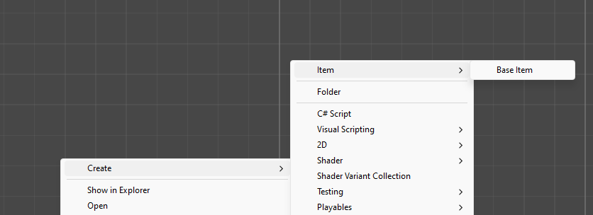
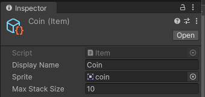

# Intro to Scriptable Objects

ScriptableObjects are a very powerful system in Unity that allows developers to store and load preset data in an easily managed way. This tutorial will guide you through creating a simple inventory system that can hold a variety of items and handle item stacking. After completing this tutorial you should be able to build on the ideas presented to create an inventory system that fits the needs of your game.

1. Create a new script called “Item”

2. Edit Item to ensure it inherits from ScriptableObject instead of MonoBehaviour:
  
```csharp
public class Item : ScriptableObject
{
}
```

3. Add the “CreateAssetMenu” tag to Item so that it can be created from the editor (we’ll do this later).
```csharp
[CreateAssetMenu(fileName = "Base Item", menuName = "Item/Base Item")]

public class Item : ScriptableObject
{
    
}
```

4. Add three variables to Item, a display name, sprite and max stack size:
```csharp
[CreateAssetMenu(fileName = "Base Item", menuName = "Item/Base Item")]

public class Item : ScriptableObject
{
    public string DisplayName;

    public Sprite Sprite;

    public int MaxStackSize = 1;
}
```

5. Return to the project tab, and right click to create a new item using our newly made ScriptableObject:
   


6. Name it “Coin”, drag an image into the “Sprite” field and set the max stack size at 10.



7. Create a new script named “Inventory”.
   
8. Create a new C# class inside the Inventory script called InventoryItem:

```csharp
public class Inventory : MonoBehaviour
{
}

public class InventoryItem
{
}
```

9. Add two variables to InventoryItem, the Item that it represents and an int for its stack count.

```csharp
public class InventoryItem
{
    public Item Item { get; private set; }

    public int StackCount { get; private set; }
}
```

10. Create a constructor for InventoryItem that takes in an Item, and sets the stack count to one.

```csharp
public class InventoryItem
{
    public InventoryItem(Item item)
    {
        Item = item;
        StackCount = 1;
    }
    public Item Item { get; private set; }

    public int StackCount { get; private set; }
}
```

11.  Add two methods to InventoryItem, AddToStack and RemoveFromStack. They will both return ints.
    
```csharp
public class InventoryItem
{
    public InventoryItem(Item item)
    {
        Item = item;
        StackCount = 1;
    }
    public Item Item { get; private set; }

    public int StackCount { get; private set; }

    public int AddToStack(int add)
    {

    }
    public int RemoveFromStack(int remove)
    {

    }
}
```

12.  AddToStack needs to check if the stack can contain all the incoming items, and return any excess:

```csharp
public int AddToStack(int add)
{
    int overflow = (StackCount + add) - Item.MaxStackSize;

    if(overflow > 0)
    {
        StackCount = Item.MaxStackSize;
        return overflow;
    }
    else
    {
        StackCount += add;
        return 0;
    }
}
```

13.  RemoveFromStack will deplete the stack count, ensure it stays positive, and return the current stack count.

```csharp
public int RemoveFromStack(int remove)
{
    StackCount -= remove;
    StackCount = Mathf.Max(0, StackCount);

    return StackCount;
}
```
